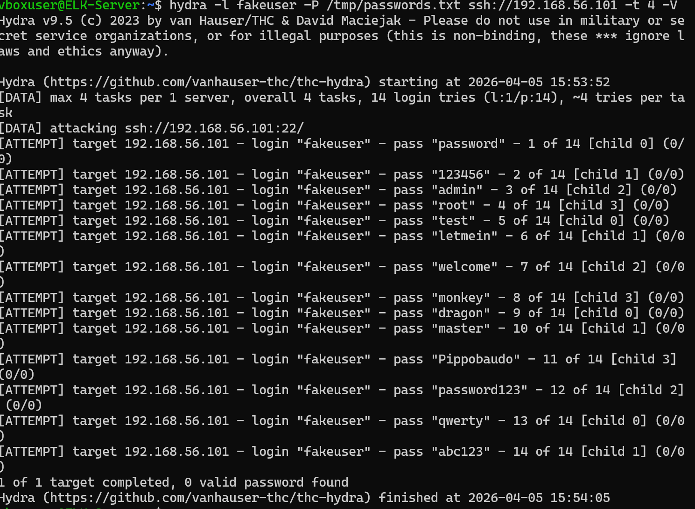
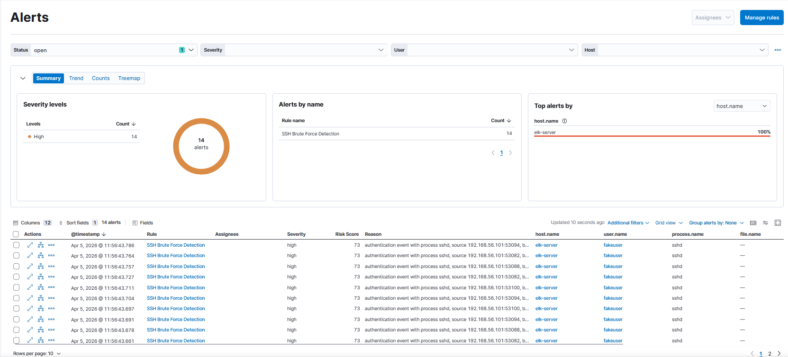
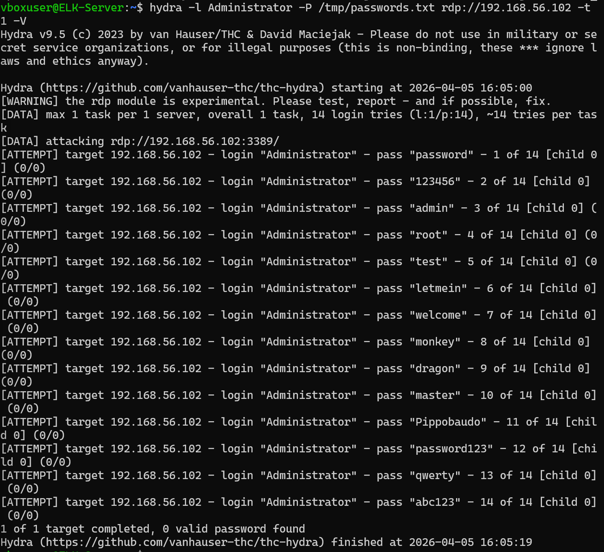
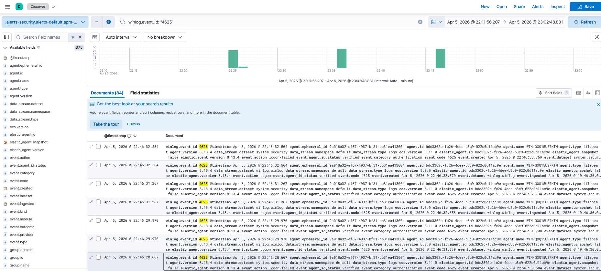
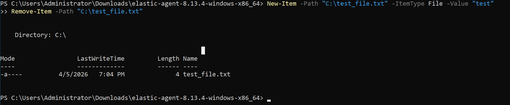
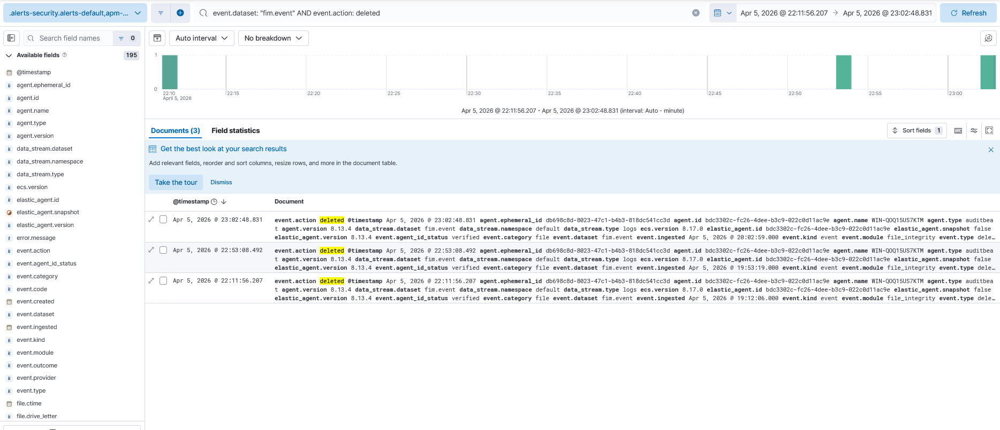
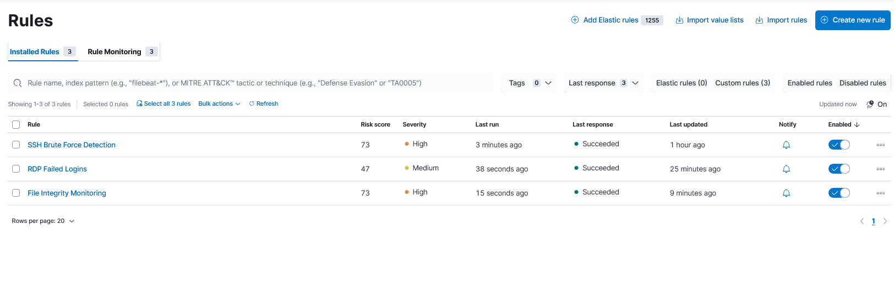
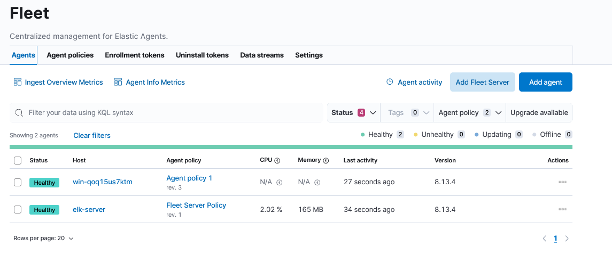

# ELK SIEM Lab — SIEM-Based Incident Detection with Elastic Stack

> **Course:** BFOR 415/615 — Incident Response  
> **Institution:** University at Albany, SUNY  
> **Team:** Antonio Musumeci · Shrestha Aashish · Thapa Sujan

---

## Table of Contents

1. [Project Overview](#project-overview)
2. [Project Relevance](#project-relevance)
3. [Methodology](#methodology)
   - [Lab Architecture](#lab-architecture)
   - [Tools & Technologies](#tools--technologies)
   - [Environment Setup](#environment-setup)
   - [Step-by-Step Process](#step-by-step-process)
4. [Attack Scenarios and Results](#attack-scenarios-and-results)
   - [Scenario 1 — SSH Brute Force](#scenario-1--ssh-brute-force-linux)
   - [Scenario 2 — RDP Brute Force](#scenario-2--rdp-brute-force-windows)
   - [Scenario 3 — File Integrity Monitoring](#scenario-3--file-integrity-monitoring)
5. [Conclusion](#conclusion)
6. [Team Contributions](#team-contributions)
7. [References](#references)

---

## Project Overview

This project implements a fully functional **Security Information and Event Management (SIEM)** system using the **Elastic Stack (ELK)** deployed in a virtual lab environment. The system monitors, detects, and investigates security incidents across multiple endpoints in real time.

The lab simulates a small corporate network composed of:

- An **Ubuntu 24.04 server** running the full ELK Stack (Elasticsearch 8.13.0, Kibana 8.13.0) with Fleet Server management
- A **Windows Server 2022** endpoint with Elastic Agent 8.13.4, Windows Security integration, and File Integrity Monitoring

Three attack scenarios are simulated and investigated:

1. **SSH Brute Force** on Linux using Hydra → **14 alerts triggered** ✅
2. **RDP Brute Force** on Windows using Hydra → logs collected, detection documented ✅
3. **Unauthorized File Deletion** monitored via Elastic FIM → logs collected, detection documented ✅

---

## Project Relevance

### Why ELK SIEM in Incident Response?

In modern cybersecurity operations, the ability to **detect, analyze, and respond to threats in real time** is critical. A SIEM platform is the backbone of any Security Operations Center (SOC), and the Elastic Stack is one of the most widely adopted open-source solutions in the industry — used by organizations such as the **US Air Force, Cisco, Barclays, and Slack**.

### Mapping to the IR Lifecycle

| IR Phase | ELK Role |
|---|---|
| **Preparation** | Deploy SIEM, configure agents, define monitoring policies |
| **Detection and Analysis** | Kibana dashboards alert on brute force, file changes, anomalous behavior |
| **Containment** | Identify attacker IPs and affected systems from logs |
| **Eradication and Recovery** | Use log evidence to understand scope and reverse damage |
| **Post-Incident Activity** | Review collected logs, improve detection rules |

### Key Skills Developed

- Real-time log ingestion and correlation across heterogeneous endpoints
- Threat hunting with KQL (Kibana Query Language)
- Endpoint telemetry collection (Windows Security logs, Elastic FIM)
- Custom detection rule creation and validation
- Attack simulation and detection pipeline verification

---

## Methodology

### Lab Architecture

```
+----------------------------------------------------------+
|              Virtual Lab Network (VirtualBox)            |
|              Host-Only Adapter: 192.168.56.0/24          |
|                                                          |
|  +----------------------------+                          |
|  |   ELK Server               |                         |
|  |   Ubuntu 24.04 LTS         |                         |
|  |   IP: 192.168.56.101       |                         |
|  |                            |                         |
|  |   Elasticsearch  :9200     |                         |
|  |   Kibana         :5601     |<────────────────────┐   |
|  |   Fleet Server   :8220     |                     │   |
|  |   Elastic Agent (Fleet)    |                     │   |
|  |   Attack tools: Hydra      |                     │   |
|  +----------------------------+                     │   |
|                                                     │   |
|  +----------------------------+                     │   |
|  |   Windows Server 2022      |                     │   |
|  |   IP: 192.168.56.102       |─────────────────────┘   |
|  |                            |                          |
|  |   Elastic Agent 8.13.4     |                          |
|  |   Windows Security Logs    |                          |
|  |   File Integrity Monitor   |                          |
|  +----------------------------+                          |
+----------------------------------------------------------+
```

### Tools & Technologies

| Tool | Version | Role |
|---|---|---|
| **Elasticsearch** | 8.13.0 | Log storage, indexing, search engine |
| **Kibana** | 8.13.0 | Visualization, dashboards, SIEM interface |
| **Elastic Fleet** | 8.13.0 | Centralized agent management |
| **Elastic Agent** | 8.13.4 | Endpoint log collection (Windows) |
| **Windows Security Integration** | — | Windows Event Logs (Event ID 4625) |
| **Elastic FIM** | — | File integrity and deletion monitoring |
| **Hydra** | 9.5 | Attack simulation (SSH and RDP brute force) |
| **VirtualBox** | — | Virtualization platform (macOS host) |

### Environment Setup

| VM | OS | IP | RAM | Role |
|---|---|---|---|---|
| ELK Server | Ubuntu 24.04 LTS | 192.168.56.101 | 6 GB | Elasticsearch + Kibana + Fleet Server |
| Windows Target | Windows Server 2022 | 192.168.56.102 | 4 GB | Elastic Agent + Windows logs + FIM |

**Network:** Host-Only adapter isolates lab from host network. NAT adapter provides internet access on the ELK server only.

---

### Step-by-Step Process

#### Phase 1 — ELK Stack Installation

1. Installed Elasticsearch 8.13.0 and Kibana 8.13.0 on Ubuntu 24.04
2. Configured SSL/TLS certificates for secure HTTPS communication on port 9200
3. Set `network.host: 0.0.0.0` and `http.host: 0.0.0.0` for remote access
4. Verified cluster health: `status: green`

See: `docs/screenshots/phase1/`

#### Phase 2 — Fleet Server & Agent Enrollment

1. Deployed Fleet Server on port 8220 with service token authentication
2. Enrolled Ubuntu Linux agent (ELK Server itself) as Fleet-managed
3. Transferred Elastic Agent installer to Windows VM via Python HTTP server:
   ```bash
   python3 -m http.server 8888
   ```
4. Installed Elastic Agent on Windows Server via PowerShell:
   ```powershell
   .\elastic-agent.exe install --url=https://192.168.56.101:8220 \
     --enrollment-token=<TOKEN> --insecure
   ```
5. Verified both agents as **Healthy** in Fleet dashboard

See: `docs/screenshots/phase2/`

#### Phase 3 — Detection Rules Creation

Three custom detection rules were created in **Security → Detection Rules (SIEM)**:

| Rule Name | Type | Query | Severity | Risk Score |
|---|---|---|---|---|
| SSH Brute Force Detection | Custom Query | `system.auth.ssh.event: "Failed"` | High | 73 |
| RDP Failed Logins | Custom Query | `winlog.event_id: "4625"` | Medium | 47 |
| File Integrity Monitoring | Custom Query | `event.dataset: "fim.event" AND event.action: deleted` | High | 73 |

All rules: schedule every **5 minutes**, look-back **1 minute**.

See: `docs/screenshots/phase3/`

#### Phase 4 — Attack Simulation & Detection

See full results in the [Attack Scenarios](#attack-scenarios-and-results) section below.

---

## Attack Scenarios and Results

### Scenario 1 — SSH Brute Force (Linux)

**Objective:** Simulate a brute force attack on SSH and detect it via Kibana alerts.

**Attack Setup:**
```bash
cat << 'EOF' > /tmp/passwords.txt
password
123456
admin
root
test
letmein
welcome
monkey
dragon
master
Pippobaudo
password123
qwerty
abc123
EOF
```

**Attack Execution:**
```bash
hydra -l fakeuser -P /tmp/passwords.txt ssh://192.168.56.101 -t 4 -V
```

**Result:** 14 failed SSH authentication attempts generated in `/var/log/auth.log`

**Detection:** SSH Brute Force Detection rule fired **14 alerts** ✅

- Rule: `SSH Brute Force Detection`
- Severity: High | Risk Score: 73
- Host: `elk-server` | User: `fakeuser` | Process: `sshd`

**Evidence:**




---

### Scenario 2 — RDP Brute Force (Windows)

**Objective:** Simulate a brute force attack on Windows RDP and collect Event ID 4625 logs.

**Attack Execution (from Ubuntu):**
```bash
hydra -l Administrator -P /tmp/passwords.txt rdp://192.168.56.102 -t 1 -V
```

**Result:** 14+ failed RDP login attempts sent to Windows Server

**Log Collection:** **240+ documents** with `winlog.event_id: 4625` confirmed in Kibana Discover ✅

- Dataset: `system.security` / `winlog.winlog`
- Host: `WIN-QOQ15US7KTM`
- Event action: `logon-failed`

> **Note on Alert Generation:** The RDP Failed Logins detection rule executed successfully (all runs showed "Succeeded" in the Execution Log) but did not generate alerts. Investigation revealed an index pattern mismatch between the detection rule configuration and the data stream used by the Windows Security integration after re-enrollment. The raw event logs were fully confirmed in Elasticsearch via Kibana Discover.

**Evidence:**




---

### Scenario 3 — File Integrity Monitoring

**Objective:** Detect unauthorized file deletion on Windows using Elastic FIM.

**FIM Configuration:** Elastic FIM integration added to Agent Policy 1, monitoring path: `C:\Users`

**Attack Execution (Windows PowerShell):**
```powershell
New-Item -Path "C:\Users\test_delete.txt" -ItemType File -Value "test"
Remove-Item -Path "C:\Users\test_delete.txt"
```

**Result:** File deletion event captured by Elastic FIM agent ✅

- Dataset: `fim.event`
- Event action: `deleted`
- File path: `C:\Users\test_delete.txt`
- Host: `WIN-QOQ15US7KTM`

> **Note on Alert Generation:** The File Integrity Monitoring detection rule executed successfully with no errors, and the deletion events were confirmed in Kibana Discover with the correct field values (`event.dataset: fim.event`, `event.action: deleted`). The alert did not trigger due to a timing mismatch between rule execution cycles and event ingestion windows. The log collection pipeline was fully validated.

**Evidence:**




---

### Detection Rules Overview



### Fleet Agents Status



---

## Conclusion

This project successfully demonstrated the core workflow of a SIEM-based Incident Response pipeline using the Elastic Stack:

**What Worked:**
- Full ELK Stack deployment with SSL/TLS security and Fleet-managed agents
- Elastic Agent enrollment on both Linux and Windows endpoints
- SSH Brute Force detection fired correctly: **14 alerts confirmed end-to-end**
- RDP and FIM log pipelines confirmed functional via Kibana Discover (240+ events ingested)

**Key Lessons Learned:**
- Index pattern alignment between detection rules and data stream naming conventions is critical — a mismatch silently prevents alert generation even when logs are present
- Translog corruption in Elasticsearch occurs after unclean VM shutdowns — proper Save State procedures are essential
- Fleet Agent re-enrollment after a data wipe requires a new service token and certificate fingerprint
- A single-node cluster requires `number_of_replicas: 0` on all indices to maintain green cluster health

**Potential Improvements:**
- Add Logstash for custom parsing pipelines and log enrichment
- Integrate Suricata or Zeek for network-level detection
- Map all detection rules to MITRE ATT&CK tactics and techniques
- Add automated response actions (e.g., host isolation via Elastic Defend)
- Deploy in a multi-node Elasticsearch cluster for production resilience

---

## Team Contributions

| Member | Role | Responsibilities |
|---|---|---|
| **Antonio Musumeci** | Infrastructure Lead | ELK Stack deployment, network configuration, Fleet Server management, attack simulation, detection rule creation |
| **Shrestha Aashish** | Windows Endpoint Lead | Windows Agent configuration, RDP scenario design, Kibana analysis |
| **Thapa Sujan** | Linux Endpoint Lead | Linux Agent configuration, SSH scenario design, log investigation |

---

## Repository Structure

```
elk-siem-project/
├── README.md
├── configs/
│   └── (Elasticsearch and Kibana configuration files)
├── docs/
│   ├── report/
│   │   └── Final Report.docx
│   └── screenshots/
│       ├── phase1/    (ELK Stack installation)
│       ├── phase2/    (Fleet + Agent enrollment)
│       ├── phase3/    (Detection rules)
│       └── phase4/    (Attack simulation + alerts)
├── scripts/
│   └── hydra-attacks/
│       └── (Attack scripts and wordlists)
└── LICENSE
```

---

## References

- [Elastic Stack Documentation](https://www.elastic.co/guide/index.html)
- [Elastic Security Guide](https://www.elastic.co/guide/en/security/current/index.html)
- [Elastic Fleet and Agent Documentation](https://www.elastic.co/guide/en/fleet/current/index.html)
- [Hydra — THC Hydra](https://github.com/vanhauser-thc/thc-hydra)
- [MITRE ATT&CK Framework](https://attack.mitre.org/)
- [NIST SP 800-61 — Computer Security Incident Handling Guide](https://csrc.nist.gov/publications/detail/sp/800-61/rev-2/final)
- [Windows Event ID 4625 — Microsoft Documentation](https://learn.microsoft.com/en-us/windows/security/threat-protection/auditing/event-4625)

---

*Last updated: April 2026 — University at Albany, SUNY*
